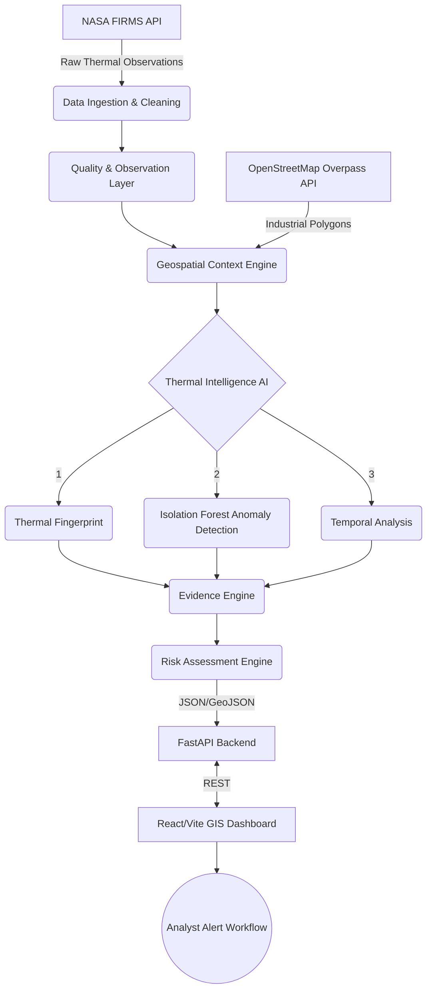

# THERMOSENTRY ARCHITECTURE

The THERMOSENTRY platform follows a sequential, decoupled data pipeline architecture that transforms raw satellite telemetry into actionable intelligence.

## Component Breakdown

1. **NASA FIRMS Data Ingestion (`process_events.py`)**: Fetches raw VIIRS/MODIS CSV data, sanitizes coordinates, and standardizes formats.
2. **Quality Layer**: Assesses satellite footprint and assigns an Observation Reliability score (GOOD, PARTIAL, LIMITED).
3. **Geospatial Context Engine (`build_features.py`)**: Queries OSM for industrial features and calculates the Haversine distance from the thermal event to the nearest industry.
4. **Anomaly Detection (`anomaly_detection.py`)**: Uses a scikit-learn Unsupervised Isolation Forest to statistically identify observations that deviate from normal FRP distributions relative to industrial proximity.
5. **Temporal Analysis (`temporal_analysis.py`)**: Groups observations by spatial grid to determine if an event is a persistent source (e.g., a factory flare) or a new outbreak.
6. **Evidence Engine (`evidence_engine.py`)**: Converts the mathematical outputs into a human-readable "Evidence Chain" for explainability.
7. **Risk Engine (`risk_engine.py`)**: Aggregates the intelligence outputs into a 0-100 Risk Score using a heuristic weighting system.
8. **FastAPI (`main.py`)**: Serves the enriched data via REST and GeoJSON endpoints.
9. **React Dashboard**: Provides the analyst investigation workspace, Leaflet map, and human-in-the-loop decision capture.
